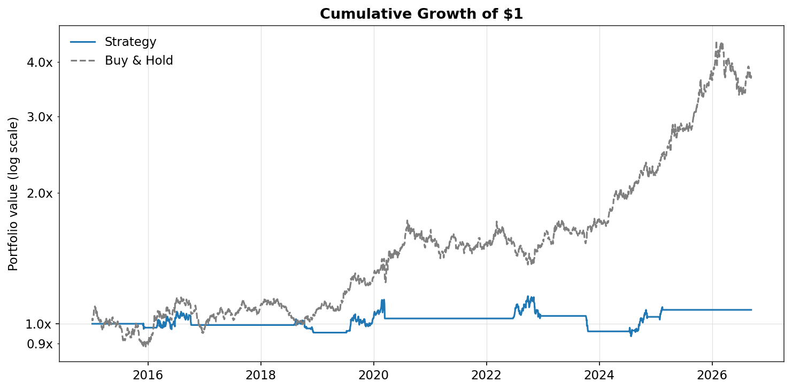
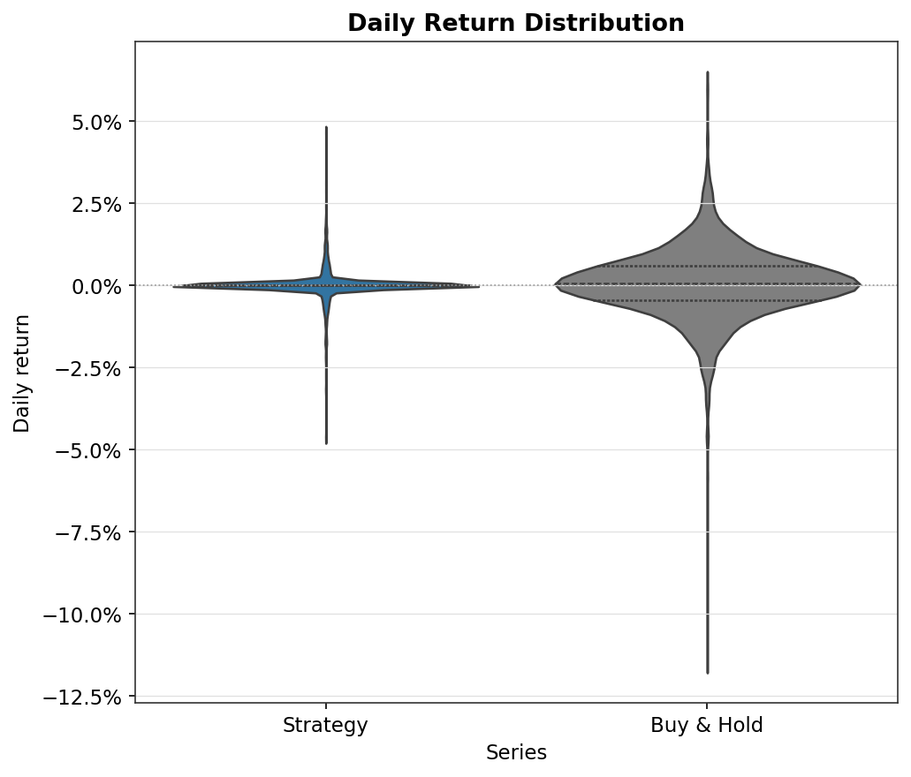
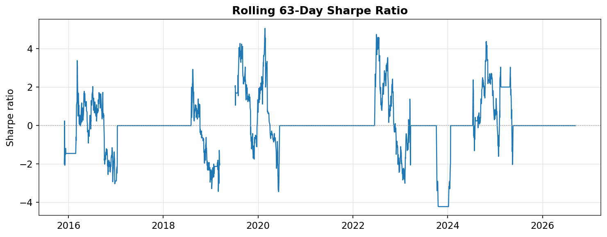
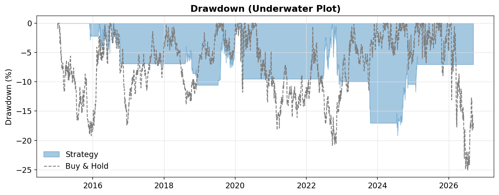
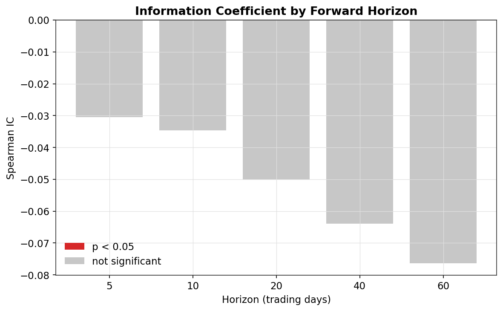

# Gold COT Positioning Strategy: A Quantitative Research Toolkit

A Python research toolkit for building, validating, and backtesting a
systematic trading signal — using CFTC Commitment of Traders (COT)
positioning data on gold as the test case, with a professional-grade
performance and risk analytics library underneath.

Built to practice the actual research workflow used in quant/market risk
roles: form a hypothesis, validate it statistically before trading on it,
backtest honestly, and report the result — including when the result is
negative.

## Headline finding

**Commercial COT positioning extremes show no statistically significant
standalone predictive power for gold returns over 2015–2026.** Adding a
200-day trend filter improves risk-adjusted performance modestly, but the
strategy still substantially underperforms simple buy-and-hold. Full
methodology and numbers below.

This is reported as-is rather than tuned until it looked better — the
point of the project is the validation process, not a manufactured win.

## What's in this repo

| Module | What it does |
|---|---|
| `src/data/loaders.py` | Pulls real price history (Yahoo Finance, via `yfinance`) |
| `src/signals/cot_signal.py` | Pulls real CFTC positioning data and builds a COT Index (percentile rank) + z-score signal |
| `src/analysis/signal_evaluation.py` | Information Coefficient (IC) analysis — validates a signal's real predictive power before any backtest |
| `src/backtest/engine.py` | Turns a signal into a position series and computes strategy returns, with realistic publication lag, position lag, and transaction costs |
| `src/performance/metrics.py` | 15 professional performance/risk metrics: Sharpe, Sortino, Calmar, Omega, tail ratio, VaR (historical + parametric), Expected Shortfall, drawdown depth/duration, rolling Sharpe |
| `src/visuals/tearsheet.py` | Institutional-style tearsheet charts (equity curve, underwater drawdown plot, return distribution violin plot, rolling Sharpe, IC decay) |
| `src/run_gold_strategy.py` | Runs the full pipeline end to end on real gold data |

## Methodology

**Signal construction.** Rather than a raw z-score (which assumes normal
positioning data), the primary signal is the **COT Index**: a percentile
rank of current commercial net positioning within a rolling 3-year (156
week) window — the standard approach in CTA/macro positioning research.
A rolling z-score is used as a secondary confirmation measure; a signal
only fires when both agree on an extreme reading.

**Validation before backtesting.** Before building any trading rule, the
signal's raw predictive power was tested directly via **Information
Coefficient (IC) analysis** — the correlation between the signal's value
and subsequent price returns at multiple forward horizons (5 to 60 days).
This decouples "does the signal carry information" from "did this
particular set of trading rules make money," which a backtest alone
can't separate.

**Backtest realism.** The backtest engine accounts for the CFTC's
publication lag (positioning data is reported roughly 3 days after the
date it describes) and lags the position by one day, so the strategy
never trades on information it couldn't have had yet. Transaction costs
(2bps per position change) are applied.

## Results

### Information Coefficient (commercial COT Index vs. forward returns)

| Horizon (days) | Spearman IC | p-value | Hit rate |
|---|---|---|---|
| 5 | -0.031 | 0.46 | 48.8% |
| 10 | -0.049 | 0.40 | 47.9% |
| 20 | -0.066 | 0.23 | 48.5% |
| 40 | -0.063 | 0.13 | 47.7% |
| 60 | -0.079 | 0.07 | 46.4% |

All horizons show weak, statistically insignificant IC (all p > 0.05),
with a hit rate consistently *below* 50%. The relationship is negative
and strengthens somewhat at longer horizons, which informed testing an
inverted signal direction (see below) rather than assuming the textbook
convention (extreme net-long = bullish) holds for every market — gold
commercials are structurally short-biased producers/hedgers, unlike, say,
agricultural commercials.

### Backtest: standalone signal vs. trend-filtered vs. buy-and-hold

| Metric | Standalone signal | Trend-filtered | Buy & Hold |
|---|---|---|---|
| Total return | -1.9% | +7.7% | +272% |
| Annualized return | -0.2% | +0.6% | +11.9% |
| Annualized volatility | 7.1% | 6.8% | 16.7% |
| Sharpe ratio | 0.01 | 0.13 | 0.76 |
| Sortino ratio | -0.01 | 0.04 | 0.69 |
| Max drawdown | -24.7% | -19.2% | -25.1% |

The trend filter (only acting on the COT signal when price also confirms
the same direction relative to its 200-day moving average) improved
Sharpe from ~0 to 0.13 and reduced max drawdown — a real, if modest,
improvement. It does not come close to closing the gap with buy-and-hold,
which benefited from a strong structural gold bull market over this
period that a mostly-flat positioning-based strategy largely missed.

## Visuals

*Strategy stays roughly flat while gold trends strongly upward — visual
confirmation that the signal is inactive too often to capture the trend.*

*The strategy's tall, narrow spike near zero reflects its high kurtosis
(27.6) — long stretches of no position punctuated by occasional large
moves when a position is on.*

*Flat at exactly 0 during inactive periods (zero variance), with volatile
swings between +4 and -4 during the sparse active windows — a small-sample
artifact rather than evidence of real regime-switching skill.*

## Limitations and honest caveats

- Single instrument (gold), single trader category (commercial) as the
  primary test — results may not generalize to other markets or to
  large speculator positioning.
- The trend-filter test was pre-specified as one hypothesis, not
  discovered via a parameter search, but it is still only one test — it
  hasn't been cross-validated out-of-sample beyond the period shown.
- Weekly COT data means a fundamentally lower-frequency signal than daily
  price action; the mismatch in observation frequency limits how precise
  any timing conclusion can be.

## What I'd test next

- Non-commercial (large speculator) positioning as an alternative signal
- Cross-asset test: does the same weak-negative-IC pattern hold for
  other commodities, or is gold idiosyncratic?
- A regime-conditional test: does positioning matter more in low-volatility
  vs. high-volatility environments?

## Setup

\`\`\`bash
python -m venv venv
source venv/bin/activate       # Windows: venv\Scripts\activate
pip install -r requirements.txt
\`\`\`

## Usage

\`\`\`bash
python -m src.run_gold_strategy
\`\`\`

Runs the full pipeline: fetches real gold price and COT data, runs IC
analysis, backtests both the standalone and trend-filtered strategy, and
saves the tearsheet visuals to `data/`.