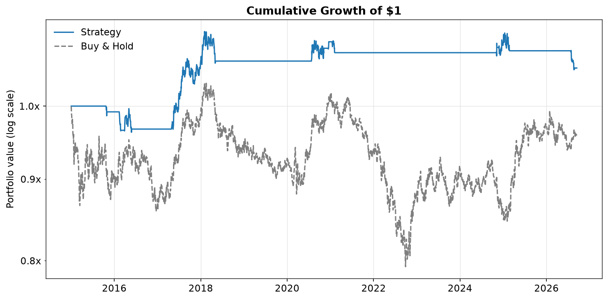
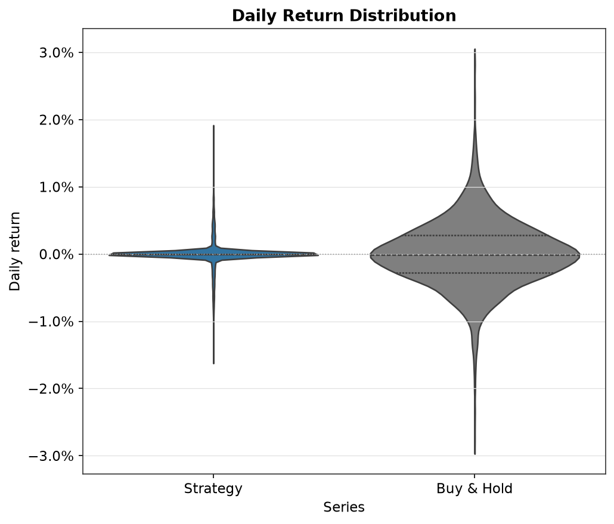
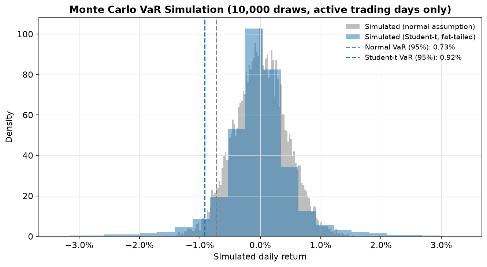
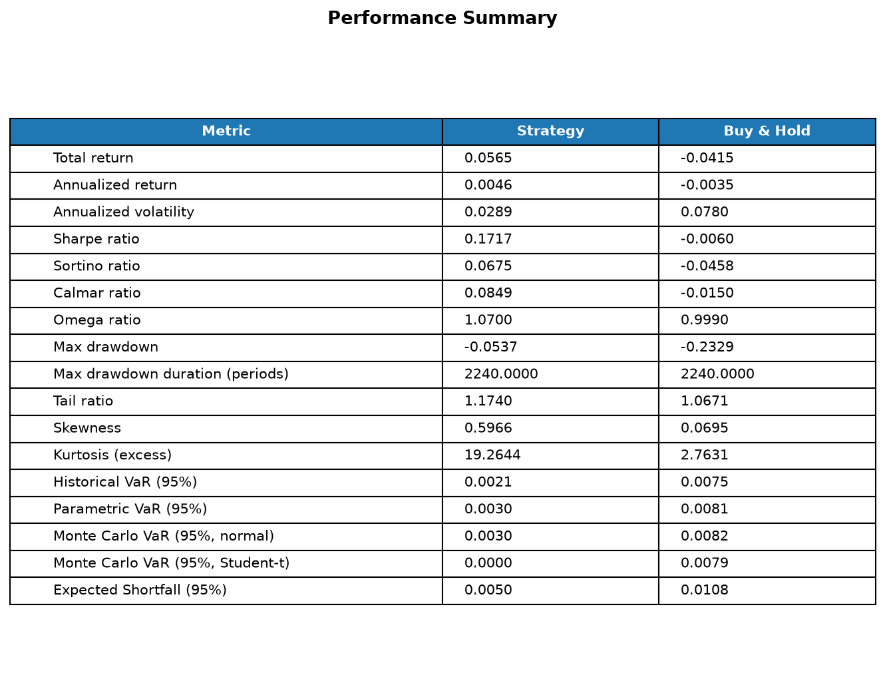

# COT Positioning Strategy: A Multi-Market Quantitative Research Toolkit

A Python research toolkit for building, validating, and backtesting a systematic trading signal derived from CFTC Commitment of Traders (COT) positioning data. The signal is tested across three markets (gold, EUR/USD, and USD/JPY) and supported by a professional-grade performance and risk analytics library.

The project follows the research workflow used in quantitative and market risk roles: form a hypothesis, validate it statistically before trading on it, test it across multiple markets rather than a single convenient case, backtest with realistic assumptions, and report the result regardless of outcome.

## Headline finding

Commercial COT positioning shows a statistically significant signal in EUR/USD (p = 0.012 at a 60-day horizon), a marginal signal in gold (p = 0.067), and no signal in USD/JPY (p = 0.97). In EUR/USD, a COT-based strategy outperformed buy-and-hold over the sample period. This was not driven by high absolute strategy returns, but by EUR/USD trending downward overall while the strategy remained defensively positioned.

Results are reported market by market rather than selecting the most favorable outcome, in order to show where the signal holds up and where it does not.

## Repository structure

| Module | Description |
|---|---|
| `src/data/loaders.py` | Retrieves price history from Yahoo Finance via `yfinance` |
| `src/signals/cot_signal.py` | Retrieves CFTC positioning data and constructs a COT Index (percentile rank) and z-score signal, configurable by market |
| `src/analysis/signal_evaluation.py` | Information Coefficient (IC) analysis, used to validate signal predictive power prior to backtesting |
| `src/backtest/engine.py` | Converts a signal into a position series and computes strategy returns, incorporating publication lag, position lag, transaction costs, and a trend-confirmation filter |
| `src/performance/metrics.py` | Performance and risk metrics, including Sharpe, Sortino, Calmar, Omega, tail ratio, historical and parametric VaR, Expected Shortfall, drawdown depth and duration, and rolling Sharpe |
| `src/visuals/tearsheet.py` | Institutional-style tearsheet visualizations: equity curve, underwater drawdown plot, return distribution, rolling Sharpe, and IC decay |
| `src/run_multi_market_strategy.py` | Runs the full pipeline across all three markets, including a reliability guard on low-sample results |

## Methodology

**Signal construction.** The primary signal is the COT Index, a percentile rank of current commercial net positioning within a rolling three-year (156-week) window. This is the standard approach used in CTA and macro positioning research, chosen over a raw z-score because positioning data is not normally distributed. A rolling z-score serves as a secondary confirmation measure, with a signal firing only when both measures agree on an extreme reading.

**Validation prior to backtesting.** Before constructing any trading rule, each market's signal was evaluated using Information Coefficient (IC) analysis: the correlation between the signal's value and subsequent returns across multiple forward horizons (5 to 60 days). This isolates whether a signal carries genuine predictive information from whether a particular set of trading rules happened to be profitable, a distinction a backtest alone cannot make.

**Signal direction.** Signal direction is determined by a single, pre-specified rule: the sign of the average IC across all horizons, decided before any backtest is run and applied identically across all three markets. This avoids assuming a fixed textbook convention or selecting direction after observing backtest results.

**Reliability guard.** After applying the trend filter, some markets retain very few active trading days. USD/JPY is one such case. A small number of active periods can produce unstable statistics, including extreme kurtosis and undefined tail ratios, that appear precise but are not meaningful. The pipeline checks the number of active trading days against a minimum threshold (30) and excludes unreliable results from the summary rather than reporting misleading figures.

## Results

### Information Coefficient by market (60-day horizon)

| Market | Spearman IC | p-value | Hit rate |
|---|---|---|---|
| Gold | -0.077 | 0.067 | 46.4% |
| EUR/USD | -0.105 | 0.012 | 41.9% |
| USD/JPY | -0.002 | 0.969 | 51.7% |

### Backtest summary

| Metric | Gold | EUR/USD | USD/JPY |
|---|---|---|---|
| Baseline Sharpe | 0.01 | 0.12 | 0.05 |
| Trend-filtered Sharpe | 0.13 | 0.17 | Excluded (25 active days, below reliability threshold) |
| Buy-and-hold Sharpe | 0.76 | -0.01 | 0.28 |

Gold and USD/JPY both underperform their respective buy-and-hold benchmarks. In gold, a mostly-flat, low-frequency signal missed a sustained structural bull market. In USD/JPY, there is effectively no signal, with an IC near zero and a hit rate close to chance. EUR/USD is the one market in which the signal both validates statistically and produces a strategy that outperforms its own benchmark.

## Visuals

EUR/USD, the primary result:







Gold and USD/JPY tearsheets are available in `data/gold/` and `data/usdjpy/` for comparison.

## Limitations

- The analysis covers three markets, one trader category (commercial), and one lookback window (156 weeks). This is a focused test rather than an exhaustive scan.
- EUR/USD's outperformance relative to buy-and-hold is partly attributable to buy-and-hold itself being negative over this sample period, not solely to large absolute strategy returns.
- The trend-filter window (200-day moving average) and reliability threshold (30 active days) are standard, sensible choices, but were not optimized per market to produce these results.
- Weekly COT data is inherently lower frequency than daily price action, which limits the precision of any timing conclusion.

## Further work

- Extend the multi-market test to a broader basket, including additional FX pairs and commodities, to assess how common a EUR/USD-type result is
- Test non-commercial (large speculator) positioning as an alternative signal
- Conduct out-of-sample validation by fitting on an earlier period and testing on a later one, rather than using the full sample for both discovery and evaluation

## Setup

```bash
python -m venv venv
source venv/bin/activate       # Windows: venv\Scripts\activate
pip install -r requirements.txt
```

## Usage

```bash
python -m src.run_multi_market_strategy
```

This runs the full pipeline across all three markets: retrieving price and COT data, running IC analysis, backtesting both the standalone and trend-filtered strategy, applying the reliability guard, and saving tearsheet visuals to `data/<market>/`.
